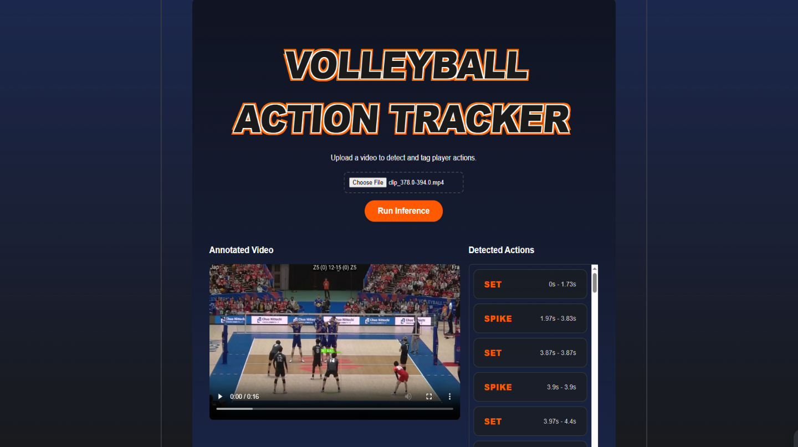

# Volleyball Action Tagging System

A computer vision pipeline that automatically detects and timestamps volleyball actions in match footage. Given a raw video, the system produces an annotated output with bounding boxes and action labels on specific players, alongside a structured event log with start and end timestamps.

**Authors:** Abiola Raji, Patrick Dang  
**Institution:** Mount Royal University, COMP 4630  
**Model weights:** https://drive.google.com/drive/folders/1OSKEmaZnWm6Zz2GID_4hIA8J8nlmjBkS?usp=drive_link

---

## Results

The pose classifier was evaluated on a held-out test set from the Roboflow Volleyball Actions Dataset (13,000+ images).

| Metric | Score |
|---|---|
| Weighted F1 | 62.64% |

**Per-class F1 scores:**

| Class | F1 Score |
|---|---|
| block | 66.4% |
| set | 65.6% |
| spike | ~62% |
| serve | ~62% |
| defense | 35.3% |

The defense class underperforms due to severe class imbalance — it represents approximately 1% of the training data. Weighted cross-entropy loss was used during training to partially mitigate this, but the imbalance remains the primary bottleneck on overall performance.

The most common failure mode is spike/serve confusion: both actions involve near-identical overhead arm mechanics but occur at different court positions — context the pose-only model cannot access.

---

## User Interface

A React web interface allows users to upload match footage and view inference results without interacting with the API directly. After submitting a video, the frontend calls `/api/v1/analyze` and displays two outputs side by side: the annotated video with bounding boxes and action labels rendered on each detected player, and a timestamped event log listing each detected action with its start and end time.

The interface is built with React and Vite, and communicates with the Flask backend over REST.


---

## What It Does

The system processes volleyball video through a four-stage pipeline:

1. **Player Detection** — YOLOv8x-pose runs on each frame to detect players and extract 17-point body keypoints (COCO format).
2. **Pose Feature Extraction** — Raw keypoints are normalized: centered on the hips, scaled by torso length, flipped to a canonical right-facing orientation, and augmented with six joint angles (elbows, knees, shoulders). This produces a 57-dimensional feature vector per player.
3. **Action Classification** — A fully-connected MLP classifies each frame into one of five volleyball actions: block, defense, serve, set, or spike. Predictions below a configurable confidence threshold are suppressed.
4. **Event Aggregation** — Frame-level detections are merged into timestamped events. Consecutive same-label detections within a configurable gap window are collapsed into a single event with a start and end time.

The REST API (`/api/v1/analyze`) accepts a video upload, runs the full pipeline, and returns the annotated video URL alongside the event list.

---

## Model Architecture

**Pose Classifier:** A four-layer MLP trained on normalized keypoint features.

```
Linear(57 -> 256) -> BatchNorm -> ReLU -> Dropout(0.3)
Linear(256 -> 256) -> BatchNorm -> ReLU -> Dropout(0.3)
Linear(256 -> 128) -> BatchNorm -> ReLU -> Dropout(0.2)
Linear(128 -> 5)
```

Training used weighted cross-entropy to handle class imbalance, the Adam optimizer, cosine annealing learning rate scheduling, and early stopping with a patience of 100 epochs over a maximum of 500 epochs.

**Keypoint Extractor:** YOLOv8x-pose, pretrained by Ultralytics, used inference-only. When multiple players are detected in a frame, the largest bounding box by area is selected as the primary player.

---

## Dataset

Source: Roboflow Volleyball Actions Dataset. The raw dataset consists of broadcast court images with bounding box annotations for labeled player actions. The preprocessing pipeline:

1. Crops individual players from court-wide images using provided bounding boxes.
2. Runs YOLOv8x-pose on each crop to extract 17-joint keypoints, discarding samples where pose detection fails.
3. Saves keypoints as JSON files organized by class and split (train / valid / test).

The keypoint extraction step runs once offline and is decoupled from classifier training, keeping training fast.

---

## Action Classes

| Label | Description |
|---|---|
| spike | Overhead attacking strike |
| defense | Digging or floor-level reception |
| block | Jumping to intercept at the net |
| set | Overhead two-handed set pass |
| serve | Service motion at the baseline |

---

## API

### `POST /api/v1/analyze`

Accepts a multipart video file upload. Runs the full detection and classification pipeline.

**Request:** `multipart/form-data` with field `file` containing the video.

**Response:**
```json
{
  "status": "success",
  "video_url": "http://<host>/outputs/annotated_<uuid>.mp4",
  "events": [
    {
      "action": "spike",
      "start_ts": 3.24,
      "end_ts": 3.96,
      "start_frame": 97,
      "end_frame": 118
    }
  ]
}
```

### `GET /outputs/<filename>`

Serves an annotated output video by filename.

---

## Key Design Decisions

**Pose-based classification over pixel-based:** The classifier operates on normalized skeletal features rather than raw image crops. This makes predictions invariant to player appearance, jersey color, and court lighting, and keeps the model lightweight enough to train without large compute.

**Canonical pose normalization:** Hip-centering and torso-length scaling ensure that player distance from the camera does not affect classification. The horizontal flip to a right-facing canonical form reduces the effective state space the classifier must learn.

**Largest-box selection:** In multi-player frames, only the player occupying the most screen area is classified. This targets the player closest to or most central in the camera's view, which is typically the one performing the action of interest.

**Event deduplication:** Rather than emitting a detection for every frame, consecutive same-label detections within `GAP_FRAMES` (default: 15 frames) are merged into a single event. This produces clean, human-readable timestamps rather than thousands of redundant per-frame entries.

---

## Limitations

- **No global context.** The model classifies based on individual body pose alone, without access to ball position, court location, or player trajectory. Spike and serve share nearly identical arm geometry and are the most frequently confused classes as a result.
- **Narrow viewpoint coverage.** Training data is predominantly rear-facing broadcast angles. Side and front perspectives are underrepresented, reducing generalization to other camera setups.
- **Noisy training data.** Many crops failed pose detection during preprocessing and were discarded. Retained samples were not verified for keypoint accuracy, meaning erroneous keypoints likely influenced training.

---

## Project Structure

```
volleyball-tagging-system/
├── backend/
│   ├── app.py                        # Flask REST API entry point
│   ├── requirements.txt
│   ├── data_preparation/
│   │   ├── extraction.py             # Batch keypoint extraction from image dataset
│   │   └── data_exploration.ipynb    # Dataset analysis and class distribution
│   ├── keypoints_json/               # Extracted keypoints organized by split and class
│   │   ├── train/
│   │   ├── valid/
│   │   └── test/
│   ├── model/
│   │   ├── model_train.py            # Classifier training pipeline
│   │   ├── model_eval.ipynb          # Evaluation: confusion matrix, F1, per-class metrics
│   │   └── visuals/                  # Saved evaluation plots
│   ├── video_pipeline/
│   │   ├── config.py                 # Model paths, thresholds, device selection
│   │   ├── inference.py              # Core video processing and classification logic
│   │   └── test_inference.py         # Standalone pipeline test script
│   ├── videos/                       # Sample input clips for testing
│   └── static_outputs/               # Annotated output videos served by the API
└── frontend/                         # React + Vite user interface
    └── src/
        └── App.jsx                   # Upload interface and results display
```

Model weights (`yolov8x-pose.pt`, `pose_classifier_best.pt`) are distributed separately via Google Drive and must be placed in `backend/model/weights/` before running inference.